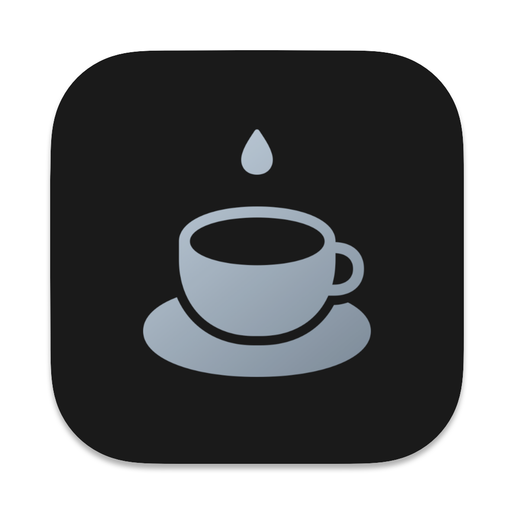
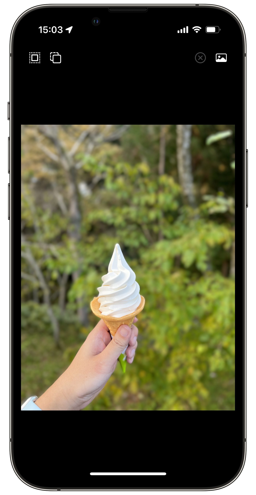
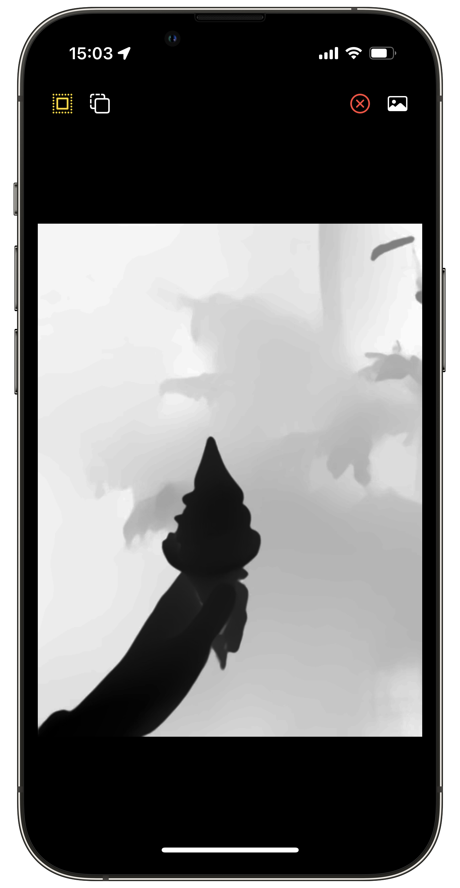
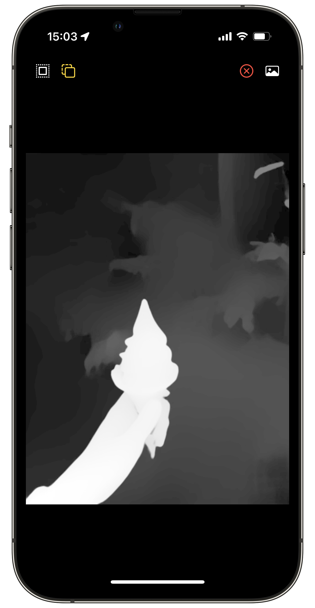
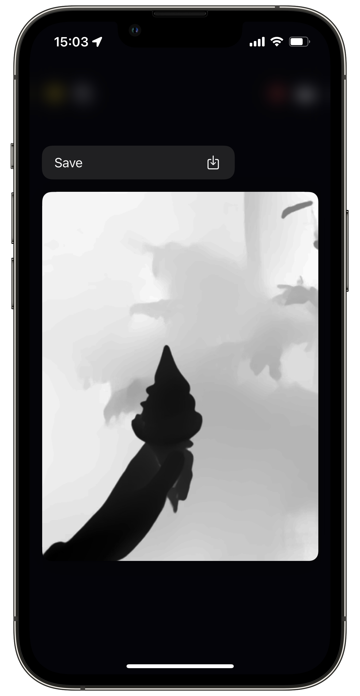
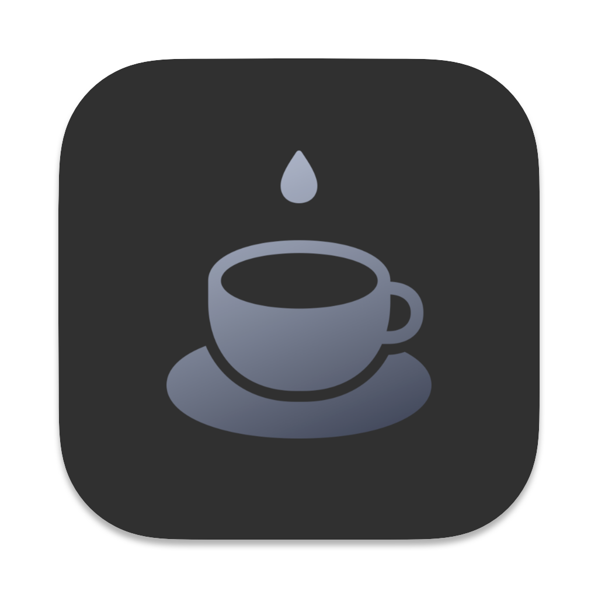
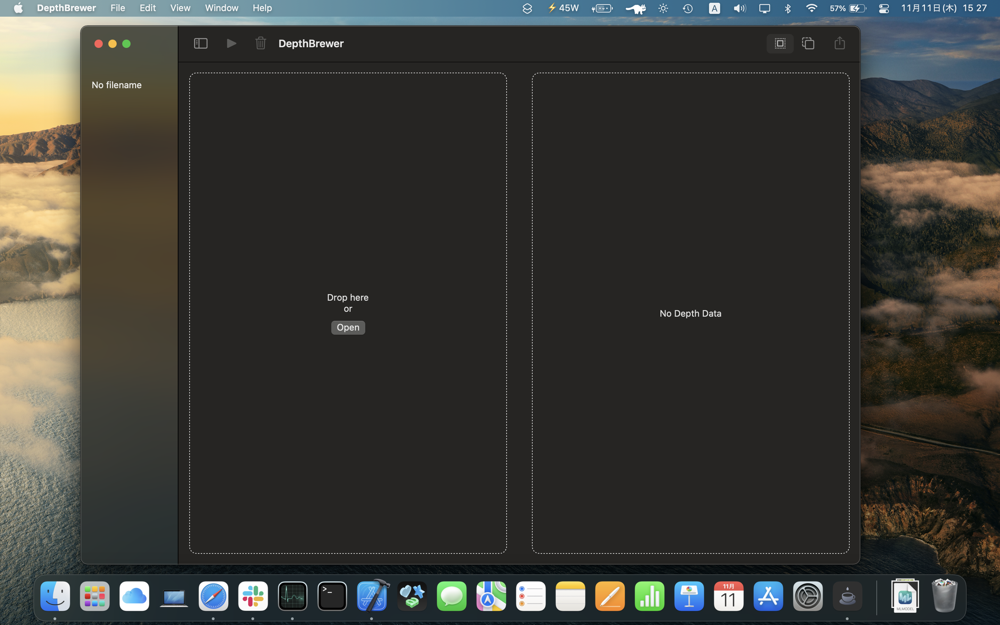

# DepthBrewer

DepthBrewer can obtain the depth data from a portrait image captured by the iPhone.

## iOS

  
  
  
  

## macOS

  
  
  
  
  

### Installation

1. Download DepthBrewer.app.zip from [releases](https://github.com/Shakshi3104/DepthBrewer/releases).
2. Unzip the file and move it to the Applications folder.

## Requirements
- iOS 15+
- macOS 11+
- Xcode 13+

## Swift Package Dependencies
- [Espresso](https://github.com/Shakshi3104/Espresso)
